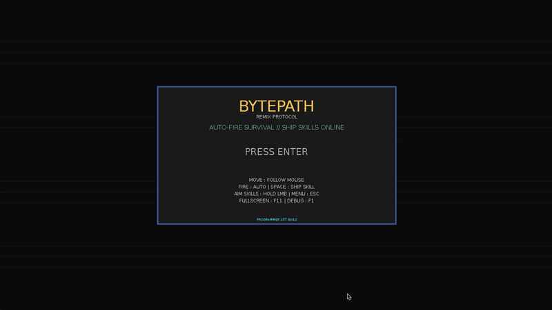
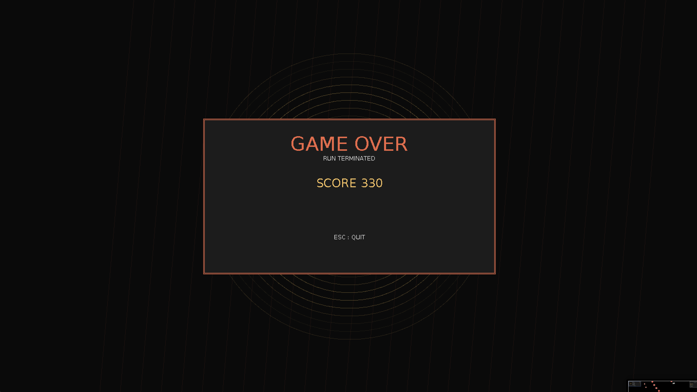

# BYTEDIEP --- BYTEPATH VARIATION

A brutal pixel-art bullet-hell roguelite demo built in LÖVE 2D.

Inspired by [BYTEPATH](https://github.com/a327ex/BYTEPATH) and their great tutorials

## Gameplay

Pilot your ship through endless waves of enemies, collecting upgrades to boost your stats, skills, and firepower. Play under 11 different ship classes with unique abilities, face off against massive bosses every 5 waves, and see how long you can survive the increasingly chaotic horde.



 
 |

## Features

- **11 Unique Ships**: Each with distinct stats, skills, and upgrade paths
- **SPACE Skills**: Auto-firing special abilities tailored to each ship class
- **Wave-Based Progression**: Difficulty scales each round with class-specific upgrade pools
- **Boss Encounters**: Challenging multi-phase bosses spawn every 5 waves
- **Skill Evolution**: Powers and cooldowns scale as you progress through runs
- **Dynamic Pickups**: Ammo, health, and fuel drops keep you in the fight
- **Expanded Arena**: Zoomed camera reveals more of the battlefield

## Project Structure

```
BYTEPATH-Remake-Lua-Love/
├── love.app/                          # LÖVE 2D application bundle
│   └── Contents/
│       └── MacOS/
│           ├── love                   # LÖVE executable
│           └── game/
│               ├── main.lua           # Entry point
│               ├── conf.lua           # Game config
│               ├── globals.lua        # Global constants
│               ├── GameObject.lua     # Base class for all entities
│               ├── Player.lua         # Player ship controller
│               ├── utils.lua          # Utility functions
│               ├── libraries/         # Third-party Lua libraries
│               │   ├── Input.lua
│               │   ├── classic/       # OOP library
│               │   ├── hump/          # HUMP utilities
│               │   ├── moses/         # Underscore.lua
│               │   └── windfield/     # Physics wrapper
│               ├── objects/           # Game entities
│               │   ├── Player.lua
│               │   ├── Projectile.lua
│               │   ├── EnemyProjectile.lua
│               │   ├── Enemy/*.lua
│               │   ├── BossEnemy.lua
│               │   ├── Pickup/*.lua
│               │   └── Effect/*.lua
│               └── rooms/
│                   └── Stage.lua      # Main gameplay room
└── README.md                          # This file
```

Special thanks to [BYTEPATH](https://github.com/a327ex/BYTEPATH) for the original inspiration and [LÖVE 2D](https://love2d.org) for the excellent framework.

---

**Can you survive the glitchy horde?**
